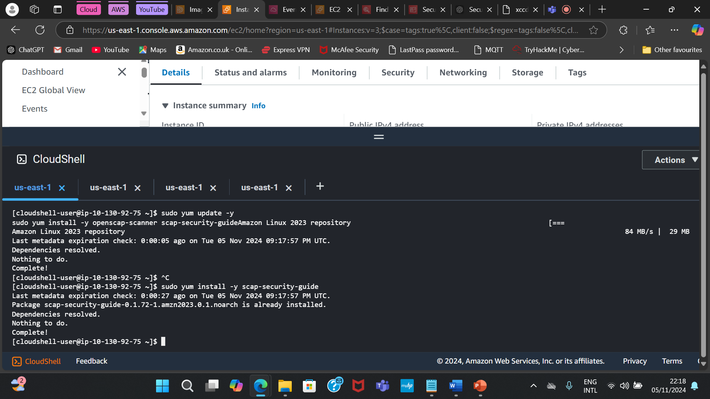
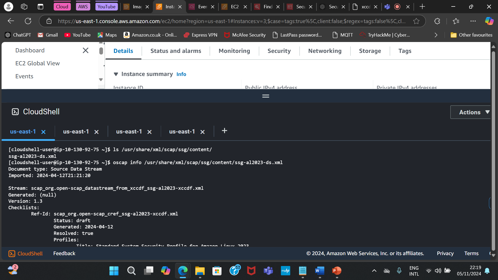

# Building a Secure Golden Image in AWS Cloud

## Description

This project demonstrates how to build a secure golden image in AWS Cloud. A golden image is a pre-configured, secure, and ready-to-use base image that can be deployed across your AWS infrastructure.

The project automates the creation and hardening of the image to ensure compliance with security best practices.

## Features

- Develop a hardened image following STIGs.
- Ensure compliance with CIS benchmarks.
- Integrate automated patching and updates to maintain ongoing security.

## Prerequisites

Before using this project, ensure you have:

- An AWS account with IAM permissions.
- Cloudshell or AWS CLI installed and configured.

## Setup Instructions

Prepare the environment by:
- Launching an EC2 Instance (Amazon Linux 2).
- Obtain Linux 2 STIGs from the DoD Cyber Exchange and apply settings using build component (pipeline recipe).
- Apply the CIS benchmarks using CIS-CAT.
- Link your SSH to the instance created using the command: ssh -i \Users\adetu\Downloads\securegoldenimagekey.pem ec2-user@54.224.218.150

- Install and run openscap with the following commands:
1. Update: sudo yum update -y
2. sudo yum install -y openscap-scanner scap-security-guide
3. Install: sudo yum install -y scap-security-guide
4. Check for correct file: ls /usr/share/xml/scap/ssg/content/
5. List available profile: oscap info /usr/share/xml/scap/ssg/content/ssg-al2023-ds.xml (your correct file name)
6. Choose a suitable profile: E.g Profiles.
7. Title: Standard System Security Profile for Amazon Linux 2023
8. Id: xccdf_org.ssgproject.content_profile_standard
9. Run the scan with the correct profile and correct file: sudo oscap xccdf eval --profile xccdf_org.ssgproject.content_profile_standard --results-arf results.xml --report report.html /usr/share/xml/scap/ssg/content/ssg-al2023-ds.xml
10. Verify the File is Uploaded: ls -l
11. Download file to local machine: Report.html





- Install ClamAV to act as an antivirus using the command: sudo yum install -y clamav
- Install Advanced Intrusion Detection Environment (AIDE) to serve as the IDS using the following command:
1. sudo yum install aide
2. sudo aide --init
3. sudo aide --check

- Set up and configure cloudtrail for logging and monitoring of the instance.
- Configure the security group of the instance by allowing only necessary inbound traffic like limit SSH access to your IP address, always use HTTPS for web communication and outbound traffic like allow all outbound traffic, so as to serve as a firewall for the instance.
- Install lynis to serve as a continuous vulnerability scanning tool for the instance. We did this with the following commands:
1. Install Lynis: sudo yum install -y lynis
2. Run Lynis: sudo lynis audit system
3. View the Lynis Log: sudo cat /var/log/lynis.log
4. View the Lynis Report: sudo cat /var/log/lynis-report.dat  OR  less /var/log/lynis-report.dat

- After installing and implementing all necessary security requirements, automate security patching for the EC2 instance using DNF-AUTOMATIC AND CRON JOB. You can achieve this using the following commands:
1. Install DNF-AUTOMATIC: sudo yum install -y dnf-automatic
2. Open the DNF File: sudo nano /etc/dnf/automatic.conf
3. Configure the file: uprade type to security, apply update to yes, emit via email, email to to example@gmail.com, set email host to smtp.gmail.com
4. Enable Automatic Update Services: sudo systemctl enable --now dnf-automatic.timer
5. Manually run the DNF Automatic script by creating a CRON Job: sudo crontab -e
6. Install the Cronie Package: sudo yum install cronie
7. Edit the crontab: sudo crontab -e
8. Add the CRON Job: 0 3 * * * /usr/bin/dnf-automatic. This command simply means "Patch by 3:00am dialy.
9. Save and Exit in vim: Press Esc, then type :wq and press Enter to save and exit.Save and Exit in Nano: Press Ctrl + O to save, then Ctrl + X to exit.

- Before creating the image, remove temporary files and unnecessary software using these commands:
1. sudo yum clean all   # Clean yum cache
2. sudo rm -rf /tmp/*   # Remove temporary files

- After making sure the instance is in a secure and stable condition by addressing all non-compliant findings, proceed to create the golden image. The image will take an hour to be up and running. Once complete, the AMI will be available for launching new instances with the same secure settings.
- Ater creating the AMI, thoroughly test the hardened image, by deploying instances from the golden image AMI, and running compliance and security tests to confirm it meets the required standards. After running these scans, review the reports generated by OpenSCAP and lynis, along with log checks, to verify that all applied benchmarks and rules are functioning.


1. Clone this repository:
   ```bash
   git clone https://github.com/your-username/aws-secure-golden-image.git
   cd aws-secure-golden-image
